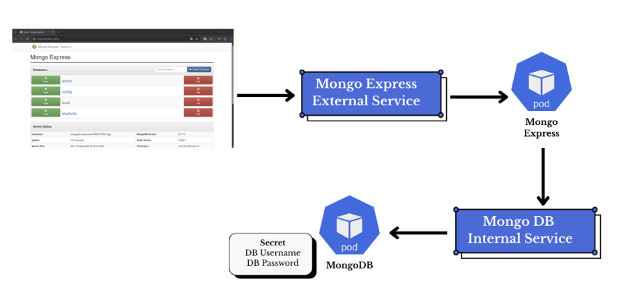

# MongoDB and Mongo Express on Kubernetes (Minikube)

Spin up a local **MongoDB** database and **Mongo Express** UI on **Kubernetes** using **Minikube**, **Docker**, and **kubectl**.

The setup has two pods and two services. Your browser reaches the **Mongo Express external service** (via `minikube service` or `kubectl port-forward`), which routes traffic to the **mongo-express pod** (UI on port 8081). From there, mongo-express talks to MongoDB through the **internal ClusterIP service** (`mongodb-service:27017`) that provides a stable address for the **mongodb pod**. Both pods read the DB admin **username/password** from the **`mongodb-secret`**.




---

## Prerequisites

- **Docker Desktop** (running)
- **Minikube**
- **kubectl**

Check your setup:
```bash
docker version
minikube version
kubectl version --client
```

> On Windows, start Docker Desktop first, then:
> ```bash
> minikube start --driver=docker
> ```

---

## Quick Start

Apply the manifests **in order**:

```bash
kubectl apply -f mongo-secret.yaml
kubectl apply -f mongo.yaml
kubectl apply -f mongo-configmap.yaml
kubectl apply -f mongo-express.yaml
```

Watch resources come up:
```bash
kubectl get pods -w
kubectl get service
```

### Access the Mongo Express UI

**Option A. Port-forward (works everywhere):**
```bash
kubectl port-forward service/mongo-express-service 8081:8081
```
Open: http://localhost:8081

**Option B. Minikube helper (NodePort):**
```bash
minikube service mongo-express-service
```
---

## File Contents

- **`mongo-secret.yaml`**  
  Kubernetes **Secret** that stores MongoDB admin **username** and **password** (Base64-encoded under `data:`).

- **`mongo.yaml`**  
  **MongoDB Deployment** + **Service**.  
  The container reads `MONGO_INITDB_ROOT_USERNAME` and `MONGO_INITDB_ROOT_PASSWORD` from the Secret on first startup. Service exposes MongoDB **internally** on port **27017**.

- **`mongo-configmap.yaml`** *(optional)*  
  **ConfigMap** with non-sensitive settings (e.g., labels/titles/flags) that can be injected into deployments as env vars.

- **`mongo-express.yaml`**  
  **Mongo Express Deployment** + **Service**.  
  Reads MongoDB host and admin credentials (from the same Secret) and serves the web UI on **8081** (exposed via ClusterIP/NodePort depending on the file).

---

## Set Your Own Username & Password

### 1) Pick credentials
Example:
```
username: admin
password: Password123
```

### 2) Encode to Base64

**Windows PowerShell:**
```powershell
[Convert]::ToBase64String([Text.Encoding]::UTF8.GetBytes("admin"))
[Convert]::ToBase64String([Text.Encoding]::UTF8.GetBytes("Password123"))
```

**macOS/Linux:**
```bash
echo -n 'admin' | base64
echo -n 'Password123' | base64
```

### 3) Update `mongo-secret.yaml`
```yaml
apiVersion: v1
kind: Secret
metadata:
  name: mongodb-secret
type: Opaque
data:
  mongo-root-username: YWRtaW4=          # base64("admin")
  mongo-root-password: UGFzc3dvcmQxMjM=  # base64("Password123")
```

Apply it:
```bash
kubectl apply -f mongo-secret.yaml
```

> **Note:** MongoDB **only creates** the root user on first startup. If you change the Secret later, you must recreate the MongoDB pod (and wipe the PVC if you use one) so it re-initializes with the new credentials.

---

## Verifying

```bash
kubectl get pods -o wide
kubectl get service
kubectl logs -l app=mongo-express
kubectl logs -l app=mongodb
```

Open the UI at http://localhost:8081 (via port-forward or `minikube service`).

---

## Changing Credentials Later

1. Update & apply `mongo-secret.yaml` with new Base64 values.
2. Recreate pods so they pick up the new Secret:

**Without PVC (ephemeral data):**
```bash
kubectl delete pod -l app=mongodb
kubectl delete pod -l app=mongo-express
```

**With PVC (persistent data):**
```bash
kubectl delete pod -l app=mongodb
kubectl delete pvc <mongodb-pvc-name>    # WARNING: deletes data
kubectl delete pod -l app=mongo-express
```
Then let Deployments recreate pods or re-apply manifests.

---

## Clean Up

```bash
kubectl delete -f mongo-express.yaml
kubectl delete -f mongo-configmap.yaml
kubectl delete -f mongo.yaml
kubectl delete -f mongo-secret.yaml
```
